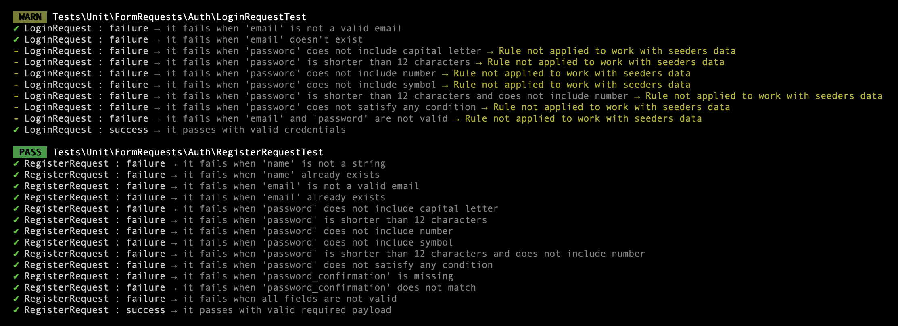

# Laravel Pest Scenarios
> Declarative, consistent and reusable test scenarios for Laravel + Pest.

---

[](https://packagist.org/packages/Jgss\LaravelPestScenarios/laravel-pest-scenarios)
[](https://github.com/julien-gassmann/laravel-pest-scenarios/actions)
[](https://packagist.org/packages/Jgss\LaravelPestScenarios/laravel-pest-scenarios)


## Introducing laravel-pest-scenario

A lightweight layer on top of Pest, designed to make Laravel tests **clear**, **uniform** and **consistent** across your team.

Instead of repeating setup logic and assertions, this package lets you define **reusable Contexts and Scenarios**.  
You can focus on **what** should happen in your tests, without worrying about **how** to implement them.

Whether you're testing API endpoints, FormRequests, or Eloquent models, laravel-pest-scenario keeps your tests **expressive, DRY and easy to maintain**.

It also provides global helper functions for commonly used elements:
- [Actors](#helper-actors)
- [Database Setups](#helper-database-setups)
- [Queries](#helper-queries)
- [JSON Structures](#helper-json-structures)
- [Mock Factory](#helper-mock-factory)

And comes with several prebuilt scenario types for both **functional** and **unit tests**:
- **Feature tests**:
    - [API routes](#api-routes)
    - [Web routes](#web-routes)
- **Unit tests**:
    - [Commands](#commands)
    - [FormRequests](#formrequest)
    - [Models](#models)
    - [Policies](#policies)
    - [Rules](#rules)
- More to come!

> [!TIP]
> This package covers roughly 80–90% of common Laravel test scenarios.
> For complex multistep logic (e.g., updating a password with multiple dependent checks), standard Pest tests may still be necessary.


## Example output

Below is an example of Pest running scenarios: successful tests appear in green, skipped tests in yellow.  
This shows how scenarios simplify test control while keeping output readable.




## Table of Contents

- [Installation](#installation)
- [Core Concepts](#core-concepts)
- [Helpers](#helpers)
- [Feature Tests](#feature-tests)
- [Unit Tests](#unit-tests)
- [Contributing / Roadmap](#contributing--roadmap)

---

# Installation

This package requires :
- Laravel 10+ and Pest 2+.
- Named routes (for most scenarios).

```
composer require --dev jgss/laravel-pest-scenarios
```
Optionally, you can publish the configuration file to customize the provided helpers:
```
php artisan vendor:publish --tag=pest-scenarios
```

---

# Core Concepts

## Contexts

A `Context` stores all the shared data needed across multiple scenarios.  
Think of it as the setup phase of a test file, but fully declarative and reusable.

Contexts can also **mock any class or service** your scenarios depend on, making it easy to replace real implementations with mocks for database, notifications, filesystem, or any other dependencies.

```php
use App\Models\User;
use Illuminate\Notifications\Notification;
use Jgss\LaravelPestScenarios\Context;
use Mockery;
use Mockery\MockInterface;
use function Jgss\LaravelPestScenarios\makeMock;

// Define this context once at the top of the test file — all related scenarios will reuse it
$context = Context::forApiRoute()->with(
    // --- Route infos -------------------------------------------------------------------------
    routeName: 'users.update',
    routeParameters: ['user' => fn () => User::first()->id],
    // --- Authenticated user ------------------------------------------------------------------
    actingAs: fn () => User::first(),
    // --- Database setup ----------------------------------------------------------------------
    databaseSetup: fn () => User::factory()->create(),
    // --- Mocked classes ----------------------------------------------------------------------
    mocks: makeMock(Notification::class, fn (MockInterface $mock) =>
        $mock->shouldReceive('send')->once()
    ),
);
```

> [!NOTE]
> Contexts are **immutable**. Modifier methods prefixed with `with` provide a clean way to adjust properties for a specific scenario without affecting others.


## Scenarios

A `Scenario` defines an individual declarative test case built on top of a `Context`.  
Rather than focusing on how the test runs, it expresses **what behavior is being verified** and **what outcome is expected**.

Each scenario type has two variants — **valid** and **invalid** — helping you clearly separate success and failure cases within the same test file.

Here’s a side-by-side comparison of how a typical API test looks using native Pest versus using laravel-pest-scenario:
#### 🟢 <ins>Valid Scenarios</ins>
```php
use App\Http\Resources\UserResource;
use App\Models\User;
use Jgss\LaravelPestScenarios\Scenario;
use function Pest\Laravel\assertDatabaseHas;

// Valid Scenario - using native Pest
it("returns 200 when user updates his own 'name' and 'email'", function () {
    // Arrange: Create acting user and payload to send
    $user = User::factory()->create();
    $payload = [
        'name' => 'New Name',
        'email' => 'new@mail.com',
    ];

    // Act: Send a PATCH request acting as user with the given payload
    $response = actingAs($user)
        ->patchJson('/users/'.$user->id, $payload);

    // Assert: Check status code and JSON structure and content
    $response
        ->assertStatus(200)
        ->assertJsonStructure(['data'])
        ->assertJson(UserResource::make($user)->response()->getData(true));

    // Assert: Check database insertion
    assertDatabaseHas('users', [
        'id' => $user->id,
        'name' => 'New Name',
        'email' => 'new@mail.com',
        'updated_by' => $user->id,
    ]);
});

// Valid Scenario - using laravel-pest-scenario
Scenario::forApiRoute()->valid(
    description: "returns 200 when user updates his own 'name' and 'email'",
    // --- Context ----------------------------------------------------------------------
    context: $context,
    // --- Payload ----------------------------------------------------------------------
    payload: ['name' => 'New Name', 'email' => 'new@mail.com'],
    // --- Expected response ------------------------------------------------------------
    expectedResponse: fn () => UserResource::make(User::first())->response(),
    // --- Database assertions ----------------------------------------------------------
    databaseAssertions: [
        fn () => assertDatabaseHas('users', [
            'id' => User::first()->id,
            'name' => 'New Name',
            'email' => 'new@mail.com',
            'updated_by' => User::first()->id,
        ]),
    ]
);
```

#### 🔴 <ins>Invalid Scenarios</ins>
```php
use App\Models\User;
use Jgss\LaravelPestScenarios\Scenario;

// Invalid Scenario - using native Pest
it("returns 404 when updating non-existent id", function () {
    // Arrange: Create acting user and payload to send
    $user = User::factory()->create();
    $payload = [
        'name' => 'New Name',
        'email' => 'new@mail.com',
    ];

    // Act: Send a PATCH request acting as user with the given payload
    $response = actingAs($user)
        ->patchJson('/users/999999', $payload);

    // Assert: Check status code and JSON content
    $response
        ->assertStatus(404)
        ->assertJson(['message' => "User '999999' not found."]);
});

// Invalid Scenario - using laravel-pest-scenario
Scenario::forApiRoute()->invalid(
    description: 'returns 404 when updating non-existent id',
    // --- Context --------------------------------------------------------------------
    context: $context->withRouteParameters(['user' => '999999']),
    // --- Status code ----------------------------------------------------------------
    expectedStatusCode: 404,
    // --- Error message --------------------------------------------------------------
    expectedErrorMessage: "User '999999' not found.",
);
```

> [!NOTE]
> The `->valid()` and `->invalid()` methods generate Pest test definitions using `it()`, so you can chain modifiers like `->skip()` or `->only()` for flexible test control.  
> They can also be wrapped inside `describe()` blocks to organize tests hierarchically.

---

# Helpers

## Helper: Actors

You can define as many actors as you need in your configuration file.
To do so, fill the 'actors' section with closures that return your custom queries, each keyed by a name:

```php
use Tests\Queries\ActorQueries; // Not provided

// Configuration example for 'resolvers.actors' (these are custom queries, not provided with the package)
'resolvers' => [
    // ...
    'actors' => [
        'user' => fn () => ActorQueries::user(),
        'admin' => fn () => ActorQueries::admin(),
        'other' => fn () => ActorQueries::other(),
        'last' => fn () => ActorQueries::last(),
        'guest' => fn () => null,
    ],
    // ...
]

```

The following helper functions are automatically available globally in your test files once configured:

```php
use function Jgss\LaravelPestScenarios\actor;
use function Jgss\LaravelPestScenarios\actorId;
use function Jgss\LaravelPestScenarios\getActor;
use function Jgss\LaravelPestScenarios\getActorId;

// ...

actor('user')     // Resolves and returns the 'user' actor instance
getActor('user')  // Same as actor(), but wrapped in a closure for lazy evaluation

actorId('user')     // Returns the ID of the resolved 'user' actor
getActorId('user')  // Same as actorId(), also wrapped in a closure
```

> [!NOTE]
> The user you resolve through these helpers is automatically passed to Pest’s `actingAs()` method when the scenario runs,
> allowing you to control exactly which user is authenticated for each test.


## Helper: Database Setups

These helpers make it easy to prepare the database for a scenario.
To do so, fill the 'database_setups' section with closures that return your custom queries, each keyed by a name:

```php
use App\Model\Dummy;
use App\Model\User;

// Configuration example for 'resolvers.database_setups' (these are custom queries, not provided with the package)
'resolvers' => [
    // ...
    'database_setups' => [            
        'create_user' => fn () => User::factory()->create(),
        'create_dummy' => fn () => Dummy::factory()->create(),
        'create_dummies' => fn () => Dummy::factory(10)->create(),
    ],
    // ...
]

```

The following helper functions are automatically available globally in your test files once configured:

```php
use function Jgss\LaravelPestScenarios\databaseSetup;
use function Jgss\LaravelPestScenarios\getDatabaseSetup;

// ...

databaseSetup('create_dummy')     // Perform roles insertions
getDatabaseSetup('create_dummy')  // Same as databaseSetup(), but wrapped in a closure for lazy evaluation
```

> [!NOTE]
> These helpers are ideal for reusing recurring database setup insertions keeping tests fully isolated and repeatable —  especially when running parallel tests or when no global seeding is available.

## Helper: Queries

Similar to the actor helpers, you can define as many reusable queries as you need in your configuration file.
To do so, fill the 'queries' section with closures that return your custom queries, each keyed by a name:

```php
use App\Model\Dummy;

// Configuration example for 'resolvers.queries' (these are custom queries, not provided with the package)
'resolvers' => [
    // ...
    'queries' => [
        'dummy_first'      => fn () => Dummy::first(),
        'dummy_count'      => fn () => Dummy::count(),
        'active_dummies'   => fn () => Dummy::where('is_active', true)->get(),
        'has_active_dummy' => fn () => Dummy::where('is_active', true)->exists(),
    ],
    // ...
]

```

Once configured, the following global helpers become available in all your test files:

```php
use function Jgss\LaravelPestScenarios\getQuery;
use function Jgss\LaravelPestScenarios\query;

// ...

query('dummy_first')    // Executes the query immediately
getQuery('dummy_first') // Same value, but wrapped in a closure
```

### Typed query helpers

If you are using strict static analysis (e.g. PHPStan level max), you may prefer helpers that guarantee a specific return type.
For that purpose, each helper also exists in a typed variant:

```php
use function Jgss\LaravelPestScenarios\getQueryBool;
use function Jgss\LaravelPestScenarios\getQueryCollection;
use function Jgss\LaravelPestScenarios\getQueryInt;
use function Jgss\LaravelPestScenarios\getQueryModel;
use function Jgss\LaravelPestScenarios\getQueryString;
use function Jgss\LaravelPestScenarios\queryBool;
use function Jgss\LaravelPestScenarios\queryCollection;
use function Jgss\LaravelPestScenarios\queryInt;
use function Jgss\LaravelPestScenarios\queryModel;
use function Jgss\LaravelPestScenarios\queryString;

// ...

// Boolean
queryBool('has_active_dummy') 
getQueryBool('has_active_dummy')

// Integer
queryInt('dummy_count')
getQueryInt('dummy_count')

// String
queryString('dummy_name')
getQueryString('dummy_name')

// Model
queryModel('dummy_first')
getQueryModel('dummy_first')

// Collection
queryCollection('active_dummies')
getQueryCollection('active_dummies')
```

### Helper for model IDs

When working with route parameters or foreign keys, you often only need the model’s ID.
For convenience, a dedicated helper exists:

```php
use function Jgss\LaravelPestScenarios\getQueryId;
use function Jgss\LaravelPestScenarios\queryId;

// Model ID
queryId('user_first')
getQueryId('user_first')
```

> [!NOTE]
> Query helpers are especially useful when:  
>  • you reuse the same database query across multiple tests,  
>  • you work with dynamic data that changes on every run (factories, parallel testing),  
>  • you want clean and concise scenario definitions.
>
> However, they are not meant to centralize all queries.
> Use them when they simplify your test code — avoid them when they make things harder to read.

## Helper: Json Structures

Just like the actor and query helpers, you can define reusable JSON structures in your configuration file.
By default, you will find the following configuration based on Laravel's formats:

```php
// Default configuration for 'json_structures'
'resolvers' => [
    'json_structures' => [
        'resource' => ['data'],
        'pagination' => [
            'data',
            'links' => ['first', 'last', 'prev', 'next'],
            'meta' => [
                'current_page', 'from', 'last_page',
                'links' => ['*' => ['url', 'label', 'active']],
            ],
        ],
        'token' => ['token'],
        'message' => ['message'],
        'none' => null,
    ],
    // ...
]

```
Each key defines a reusable JSON structure that can be referenced later in your scenarios with the following helper function:

```php
use function Jgss\LaravelPestScenarios\jsonStructure;

// ...

jsonStructure('pagination')     // Reusable structure for paginated resources
getJsonStructure('pagination')  // Same value, but wrapped in a closure
```

> [!NOTE]
> JSON structure helpers let you centralize and reuse common API response formats — keeping your tests consistent and reducing boilerplate across files.

---

## Helper: Mock Factory

This helper makes it much easier to define the mocks section inside a Context.

Instead of manually creating arrays of closures returning Mockery instances,
you can use `makeMock()` to generate a correctly formatted mock factory in a clean and readable way.

> `makeMock()` returns an associative array with the class as key and a closure returning the mock as value, ready to be spread into the `mocks` property.

```php
use Illuminate\Notifications\Notification;
use Mockery\MockInterface;
use function Jgss\LaravelPestScenarios\makeMock;

// Without using makeMock helper
mocks: [
    Notification::class => fn () => Mockery::mock(Notification::class, function (MockInterface $mock) {
        $mock->shouldReceive('send')->once();
    }),
]

// Using makeMock helper
mocks: makeMock(Notification::class, fn (MockInterface $mock) => $mock->shouldReceive('send')->once())

```

Because makeMock() returns a one-element associative array,
you can easily destructure multiple mocks inside the same context:

```php
use App\Service;
use App\OtherService;
use Jgss\LaravelPestScenarios\Context;
use Mockery\MockInterface;
use function Jgss\LaravelPestScenarios\makeMock;

// Context with multiple mocks
$context = Context::forApiRoute()->with(
    routeName: 'users.export',
    
    mocks: [
        ...makeMock(Service::class, fn (MockInterface $mock) => $mock->shouldReceive('method')),
        ...makeMock(OtherService::class, fn (MockInterface $mock) => $mock->shouldReceive('otherMethod')),
    ],
);


```

> [!NOTE]
> Mock factory help keep your scenarios expressive and clean, without repeating Mockery boilerplate everywhere.

---

# Feature Tests

## API routes

API route scenarios let you test your Laravel endpoints end-to-end — cleanly and with minimal boilerplate.

Each `Scenario` automatically handles request sending, authentication, and assertions for response structure, status code, and database state. You can also mock any class or service through the `Context`.

> [!TIP]
> To quickly get started, you can generate a prefilled test file with: <br>
> `php artisan make:scenario (ApiRoute) (Feature/TestFileName) (--R|route=route.name)`

### Context

```php
use App\Service;
use Jgss\LaravelPestScenarios\Context;
use Mockery;
use Mockery\MockInterface;
use function Jgss\LaravelPestScenarios\getActorId;
use function Jgss\LaravelPestScenarios\getDatabaseSetup;
use function Jgss\LaravelPestScenarios\makeMock;

// Define this once at the top of your test file.
// All related scenarios can reuse or extend it safely.
$context = Context::forApiRoute()->with(
    routeName: 'users.update',
    
    routeParameters: ['user' => getActorId('user')], // Default: []
    
    actingAs: 'user', // Default: fn () => null
    
    appLocale: 'en', // Default: your app default locale
    
    databaseSetup: getDatabaseSetup('createUser'), // Default: fn () => null
    
    mocks: makeMock(Service::class, fn (MockInterface $mock) => $mock->shouldIgnoreMissing()), // Default: []
);

// You can chain multiple "with" modifiers to derive a new Context instance.
$newContext = $context
    ->withRouteName('users.delete')
    ->withRouteParameters(['user' => getActorId('other')])
    ->withRoute('users.delete', ['user' => getActorId('other')]) // Aggregate 'withRouteName' and 'withRouteParameters'
    ->withActingAs('other');
    ->withAppLocale('fr')
    ->withDatabaseSetup(getDatabaseSetup('createOtherUser'))
    ->withMocks([]);
```

### Scenarios

#### 🟢 <ins>Valid Scenarios</ins>


Use the **getJsonStructure** helper function to reference pre-defined JSON structures stored in your configuration file.
This allows you to centralize and reuse common API response formats across all your tests.

```php
use App\Http\Resources\UserResource;
use Jgss\LaravelPestScenarios\Scenario;
use function Jgss\LaravelPestScenarios\actor;
use function Jgss\LaravelPestScenarios\actorId;
use function Jgss\LaravelPestScenarios\getJsonStructure;
use function Pest\Laravel\assertDatabaseHas;

// Valid Scenario - user can update his profile
Scenario::forApiRoute()->valid(
    description: "returns 200 when user updates his own 'name' and 'email'",
    
    context: $context,
    
    payload: ['name' => 'New Name', 'email' => 'new@mail.com'], // Default: []
    
    expectedStatusCode: 200, // Default: 200
    
    expectedJsonStructure: getJsonStructure('resource'), // Default: getJsonStructure('resource')
    
    expectedResponse: fn () => UserResource::make(actor('user'))->response(), // Default: null
    
    databaseAssertions: [
        fn () => assertDatabaseHas('users', [
            'id' => actorId('user'),
            'name' => 'New Name',
            'email' => 'new@mail.com',
            'updated_by' => actorId('user'),
        ]),
    ], // Default: []
);
```

#### 🔴 <ins>Invalid Scenarios</ins>

Invalid scenarios handle failure cases caused by **exceptions** or **validation errors**.

```php
use Jgss\LaravelPestScenarios\Scenario;
use function Pest\Laravel\assertDatabaseMissing;

// Invalid Scenario - based on exception failure
Scenario::forApiRoute()->invalid(
    description: 'returns 404 when updating non-existent id',
    
    context: $context->withRouteParameters(['user' => '999999']),
    
    expectedStatusCode: 404, // Default: 422
    
    expectedErrorMessage: "User '999999' not found.", // Default: null
);

// Invalid Scenario - based on validation failure
Scenario::forApiRoute()->invalid(
    description: "returns 422 when 'email' is not a valid email",
    
    context: $context,
    
    payload: ['email' => 'not_an_email'], // Default: []
    
    expectedErrorStructure: ['errors' => ['email']], // Default: []
    
    databaseAssertions: [
        fn () => assertDatabaseMissing('users', [
            'id' => actorId('user'),
            'name' => 'New Name',
            'email' => 'new@mail.com',
            'updated_by' => actorId('user'),
        ]),
    ], // Default: []
);
```

Curious about what happens under the hood ? <br>
See [ValidApiRouteScenario.php](src/Definitions/Scenarios/ApiRoutes/ValidApiRouteScenario.php)
and [InvalidApiRouteScenario.php](src/Definitions/Scenarios/ApiRoutes/InvalidApiRouteScenario.php) for the internal Pest definitions used by this scenarios type.

## Web routes

Web route scenarios let you test routes returning rendered HTML views or redirects, including those triggered by validation errors.
They provide the same syntax and automation as API scenarios — request building, authentication, mocking and assertions — but focus on the behavior and state of the response (view content, redirects, session state, etc.) rather than JSON structures.

Redirect behavior can be controlled using `shouldFollowRedirect`, and you can define the originating page with `fromRoute` for form submissions and post-redirect-get flows.

> [!TIP]
> To quickly get started, you can generate a prefilled test file with: <br>
> `php artisan make:scenario (WebRoute) (Feature/TestFileName) (--R|route=route.name)`

> [!IMPORTANT]
> Browser-based or JavaScript-rendered content is not supported yet.
> The `responseAssertions` property currently works only with backend-rendered views (Blade, simple HTML, etc.).

### Context

WebRoute contexts let you control where the request comes from using `fromRouteName` and `fromRouteParameters`.  
This is especially useful when testing invalid scenarios that trigger redirects (e.g., validation errors), since the framework redirects back to this originating route.  
If not provided, both values default to the same `routeName` and `routeParameters` defined in the Context.

```php
use App\Service;
use Jgss\LaravelPestScenarios\Context;
use Mockery;
use Mockery\MockInterface;
use function Jgss\LaravelPestScenarios\getActorId;
use function Jgss\LaravelPestScenarios\getDatabaseSetup;
use function Jgss\LaravelPestScenarios\makeMock;

// Define this once at the top of your test file.
// All related scenarios can reuse or extend it safely.
$context = Context::forWebRoute()->with(
    routeName: 'users.update',
    
    routeParameters: ['user' => getActorId('user')], // Default: []
    
    fromRouteName: 'users.edit', // Default: routeName
    
    fromRouteParameters: ['user' => getActorId('user')], // Default: routeParameters
    
    actingAs: 'user', // Default: fn () => null
    
    appLocale: 'en', // Default: your app default locale
    
    databaseSetup: getDatabaseSetup('createUser'), // Default: fn () => null
    
    mocks: makeMock(Service::class, fn (MockInterface $mock) => $mock->shouldIgnoreMissing()), // Default: []
);

// You can chain multiple "with" modifiers to derive a new Context instance.
$newContext = $context
    ->withRouteName('users.delete')
    ->withRouteParameters(['user' => getActorId('other')])
    ->withRoute('users.delete', ['user' => getActorId('other')]) // Aggregate 'withRouteName' and 'withRouteParameters'
    ->withFromRouteName('users.edit')
    ->withFromRouteParameters(['user' => getActorId('other')])
    ->withFromRoute('users.edit', ['user' => getActorId('other')]) // Aggregate 'withFromRouteName' and 'withFromRouteParameters'
    ->withActingAs('other');
    ->withAppLocale('fr')
    ->withDatabaseSetup(getDatabaseSetup('createOtherUser'))
    ->withMocks([]);
```

### Scenarios

Each closure in the `responseAssertions` array can receive the response object, letting you assert view content, session state, authentication, and other response-related conditions.

#### 🟢 <ins>Valid Scenarios</ins>

```php
use Illuminate\Testing\TestResponse;
use Jgss\LaravelPestScenarios\Scenario;
use function Jgss\LaravelPestScenarios\actor;
use function Jgss\LaravelPestScenarios\actorId;
use function Pest\Laravel\assertAuthenticated;
use function Pest\Laravel\assertDatabaseHas;

// Valid Scenario - user can update his profile
Scenario::forWebRoute()->valid(
    description: "returns 200 when user updates his own 'name' and 'email'",
    
    context: $context,
    
    payload: ['name' => 'New Name', 'email' => 'new@mail.com'], // Default: []
    
    shouldFollowRedirect: false, // Default: false
    
    expectedStatusCode: 200, // Default: 200
    
    responseAssertions: [
        fn () => assertAuthenticated(),
        fn (TestResponse $res) => $res
            ->assertDontSee('John Doe')
            ->assertSee('New Name')
            ->assertViewHas('user', actor('user')),
    ], // Default: []
    
    databaseAssertions: [
        fn () => assertDatabaseHas('users', [
            'id' => actorId('user'),
            'name' => 'New Name',
            'email' => 'new@mail.com',
            'updated_by' => actorId('user'),
        ]),
    ], // Default: []
);
```

#### 🔴 <ins>Invalid Scenarios</ins>

When testing web route scenarios,
`shouldFollowRedirect` lets you choose between following the redirect to assert the final view content,
or only checking the initial response status and redirect target.

```php
use Illuminate\Support\ViewErrorBag;
use Jgss\LaravelPestScenarios\Scenario;
use function Jgss\LaravelPestScenarios\actorId;
use function Pest\Laravel\assertDatabaseMissing;

// Invalid Scenario - user update without redirect
Scenario::forWebRoute()->invalid(
    description: "returns 422 with redirect when 'email' is invalid",
    
    context: $context,
    
    payload: ['email' => 'not_an_email'], // Default: []
    
    responseAssertions: [
        fn ($res) => $res
            ->assertRedirectToRoute('users.edit', ['user' => actorId('user')]),
    ], // Default: []
    
    databaseAssertions: [
        fn () => assertDatabaseMissing('users', [
            'id' => actorId('user'),
            'email' => 'not_an_email',
        ]),
    ], // Default: []
);

// Invalid Scenario - user update with redirect
Scenario::forWebRoute()->invalid(
    description: "redirects to 'users.edit' with corresponding errors when 'email' is invalid",
    
    context: $context,
    
    payload: ['email' => 'not_an_email'], // Default: []
    
    shouldFollowRedirect: true, // Default: false
    
    expectedStatusCode: 200, // Default: 302
    
    responseAssertions: [
        fn ($res) => $res
            ->assertDontSee('not_an_email')
            ->assertViewHas(
                'errors',
                fn (ViewErrorBag $errors) => $errors->any()
                    && $errors->has('email')
            ),
    ], // Default: []
    
    databaseAssertions: [
        fn () => assertDatabaseMissing('users', [
            'id' => actorId('user'),
            'email' => 'not_an_email',
        ]),
    ], // Default: []
);
```

Curious about what happens under the hood ? <br>
See [ValidWebRouteScenario.php](src/Definitions/Scenarios/WebRoutes/ValidWebRouteScenario.php)
and [InvalidWebRouteScenario.php](src/Definitions/Scenarios/WebRoutes/InvalidWebRouteScenario.php) for the internal Pest definitions used by this scenarios type.

---

# Unit Tests

## Commands

Command scenarios let you test your Artisan console commands — focusing on their arguments, options, input/output behavior, and interactions with dependencies.

They support interactive and non-interactive commands via Laravel’s built-in command testing features (expectsQuestion(), expectsOutput(), etc.), allow mocking of services like the filesystem or mail, and can include database assertions to fully validate side effects.

> [!TIP]
> To quickly get started, you can generate a prefilled test file with: <br>
> `php artisan make:scenario (Command) (Unit/TestFileName) (--A|command=artisan:command)`

### Context

```php
use Illuminate\Filesystem\Filesystem;
use Jgss\LaravelPestScenarios\Context;
use Mockery;
use Mockery\MockInterface;
use function Jgss\LaravelPestScenarios\getDatabaseSetup;
use function Jgss\LaravelPestScenarios\makeMock;

// Define this once at the top of your test file.
// All related scenarios can reuse or extend it safely.
$context = Context::forCommand()->with(
    command: 'make:scenario',
    
    appLocale: 'en', // Default: your app default locale
    
    databaseSetup: getDatabaseSetup(), // Default: fn () => null
    
    mocks: makeMock(Filesystem::class, function (MockInterface $mock) {
        $mock->shouldReceive('ensureDirectoryExists')->once();
        $mock->shouldReceive('put')->once();
    }), // Default: []
);

// You can chain multiple "with" modifiers to derive a new Context instance.
$newContext = $context
    ->withDatabaseSetup('createManyUser')
    ->withMocks([])
    ->withAppLocale('fr');
```

### Scenarios

#### 🟢 <ins>Valid Scenarios</ins>

Each valid scenario tests a successful command execution using Laravel’s built-in command testing methods.

```php
use Illuminate\Notifications\Notification;
use Illuminate\Testing\PendingCommand;
use Jgss\LaravelPestScenarios\Scenario;
use function Jgss\LaravelPestScenarios\actorId;
use function Jgss\LaravelPestScenarios\getActorId;
use function Jgss\LaravelPestScenarios\makeMock;
use function Pest\Laravel\assertDatabaseHas;

// Valid Scenario - using interactive command
Scenario::forCommand()->valid(
    description: 'asks for scenario type and file name when missing all  arguments (ApiRoute test file).',
    
    context: $context,
    
    arguments: '--route=users.index', // Default: null
    
    commandAssertions: fn (PendingCommand $command) => $command
        ->expectsChoice(
            question: 'Which type of Scenario should the test file perform ?',
            answer: 'ApiRoute',
            answers: ['ApiRoute', 'WebRoute', 'Command', 'FormRequest', 'Rule', 'Model', 'Policy'],
        )
        ->expectsQuestion(
            question: 'What is your test file name ?',
            answer: 'Feature/Test'
        )
        ->expectsOutput('Scenario test file created successfully.')
        ->assertSuccessful()
        ->assertExitCode(0), // Default: null
);

// Valid Scenario - using mocks and database assertions (with command activate:user)
Scenario::forCommand()->valid(
    description: 'activates an existing user and sends a notification',
    
    context: $newContext->withMocks(
        makeMock(Notification::class, function (MockInterface $mock) { 
            $mock->shouldReceive('send')->once()
        })
    ),
    
    arguments: getActorId('last'), // Default: null
    
    commandAssertions: fn (PendingCommand $command) => $command
        ->expectsOutputToContain('User activated successfully.')
        ->assertExitCode(0), // Default: null
        
    databaseAssertions: [
        fn () => assertDatabaseHas('users', [
            'id' => actorId('last'),
            'is_active' => true,
        ]),
    ], // Default: []
);
```

#### 🔴 <ins>Invalid Scenarios</ins>

Invalid scenarios simulate failing commands caused by invalid arguments or application errors.

```php
use Illuminate\Testing\PendingCommand;
use Jgss\LaravelPestScenarios\Scenario;

// Non-existing scenario type
Scenario::forCommand()->invalid(
    description: "fails when 'type' parameter does not match existing types.",
    
    context: $context,
    
    arguments: 'NotExisting Feature/Test', // Default: null
    
    commandAssertions: fn (PendingCommand $command) => $command
        ->expectsOutputToContain('Scenario type NotExisting does not exist.')
        ->assertFailed()
        ->assertExitCode(1), // Default: null
        
    databaseAssertions: [], // Default: []
);
```

Curious about what happens under the hood ? <br>
See [ValidCommandScenario.php](src/Definitions/Scenarios/Commands/ValidCommandScenario.php)
and [InvalidCommandScenario.php](src/Definitions/Scenarios/Commands/InvalidCommandScenario.php) for the internal Pest definitions used by this scenarios type.

##  FormRequest

FormRequest scenarios let you test your Laravel FormRequest classes in isolation — focusing purely on their validation and authorization logic, without involving controllers or actual HTTP calls.

These scenarios simulate Laravel’s request lifecycle accurately, allowing you to test even complex validation logic (based on the current route, authenticated user, route-model bindings, or interdependent fields.)

> [!TIP]
> To quickly get started, you can generate a prefilled test file with: <br>
> `php artisan make:scenario (FormRequest) (Unit/TestFileName) (--C|class=ClassName) (--R|route=routeName)`

### Context

```php
use App\Http\Requests\User\UserRequest;
use App\Service;
use Jgss\LaravelPestScenarios\Context;
use Mockery;
use Mockery\MockInterface;
use function Jgss\LaravelPestScenarios\getActorId;
use function Jgss\LaravelPestScenarios\getDatabaseSetup;
use function Jgss\LaravelPestScenarios\makeMock;

// Define this once at the top of your test file.
// All related scenarios can reuse or extend it safely.
$context = Context::forFormRequest()->with(
    formRequestClass: UserRequest::class, 
    
    routeName: 'users.update',  // Default: null
    
    routeParameters: ['user' => getActorId('user')], // Default: []
    
    actingAs: 'user', // Default: fn () => null
    
    appLocale: 'en', // Default: your app default locale
    
    databaseSetup: getDatabaseSetup('createUser'), // Default: fn () => null

    mocks: makeMock(Service::class, fn (MockInterface $mock) => $mock->shouldIgnoreMissing()), // Default: []
);

// You can chain multiple "with" modifiers to derive a new Context instance.
$newContext = $context
    ->withRouteName('users.delete')
    ->withRouteParameters(['user' => getActorId('other')])
    ->withActingAs('other')
    ->withAppLocale('fr')
    ->withDatabaseSetup(getDatabaseSetup('createOtherUser'))
    ->withMocks([]);
```

### Scenarios

#### 🟢 <ins>Valid Scenarios</ins>

```php
use Jgss\LaravelPestScenarios\Scenario;

// Valid Scenario - password updating
Scenario::forFormRequest()->valid(
    description: "passes with valid 'password' and 'password_confirmation' (Password123!)",
    
    context: $context,
    
    payload: ['password' => 'Password123!', 'password_confirmation' => 'Password123!'], // Default: []
    
    shouldAuthorize: true, // Default: true
);
```

#### 🔴 <ins>Invalid Scenarios</ins>

Validation errors can be provided either as **raw messages** or as **translation keys** (recommended).

```php
use Jgss\LaravelPestScenarios\Scenario;
use function Jgss\LaravelPestScenarios\actor;

// Invalid Scenario - expecting authorize() method to return false
Scenario::forFormRequest()->invalid(
    description: "ensures 'authorize()' fails when performed by guest",
    
    context: $context->actingAs(actor('guest')),
    
    shouldAuthorize: false // Default: true
);

// Invalid Scenario - using translation key for expected errors with French translation
Scenario::forFormRequest()->invalid(
    description: "fails when 'password' is shorter than 12 characters and does not include number",
    
    context: $context->withAppLocale('fr'),
    
    payload: ['password' => 'Password!', 'password_confirmation' => 'Password!'], // Default: []
    
    expectedValidationErrors: ['password' => ['min.string|min=12', 'password.numbers']], // Default: []
);

// Invalid Scenario - same test as previous one, but using raw messages for expected errors and default locale instead
Scenario::forFormRequest()->invalid(
    description: "fails when 'password' is shorter than 12 characters and does not include number",
    
    context: $context,
    
    payload: ['password' => 'Password!', 'password_confirmation' => 'Password!'], // Default: []
    
    expectedValidationErrors: ['password' => [
        'The password field must be at least 12 characters.', 
        'The password field must contain at least one number.'
    ]], // Default: []
);

// Invalid Scenario - field depending on another one
Scenario::forFormRequest()->invalid(
    description: "fails when 'password_confirmation' is missing",
    
    context: $context,
    
    payload: ['password' => 'Password123!'], // Default: []
    
    expectedValidationErrors: ['password_confirmation' => ['required_with|values=password']], // Default: []
    
);
```

> [!NOTE]
> When using **translation keys**, placeholders can be added using the format: `'translation.key|placeholder=value'`.
>
> _example : `'age' => ['between.numeric|min=18|max=25']`_

Curious about what happens under the hood ? <br>
See [ValidFormRequestScenario.php](src/Definitions/Scenarios/FormRequests/ValidFormRequestScenario.php)
and [InvalidFormRequestScenario.php](src/Definitions/Scenarios/FormRequests/InvalidFormRequestScenario.php) for the internal Pest definitions used by this scenarios type.

## Models

Model scenarios let you test your Eloquent Model classes in isolation — focusing on the methods, traits, and query scopes defined on a model.

Each scenario follows a simple philosophy: you provide an input and an expected output, and the scenario verifies that the model behaves as intended.

> [!TIP]
> To quickly get started, you can generate a prefilled test file with: <br>
> `php artisan make:scenario (Model) (Unit/TestFileName) (--C|class=ClassName)`

### Context

```php
use App\Service;
use Jgss\LaravelPestScenarios\Context;
use Mockery;
use Mockery\MockInterface;
use function Jgss\LaravelPestScenarios\getDatabaseSetup;
use function Jgss\LaravelPestScenarios\makeMock;

// Define this once at the top of your test file.
// All related scenarios can reuse or extend it safely.
$context = Context::forModel()->with(
    actingAs: 'user', // Default: fn () => null
    
    appLocale: 'en', // Default: your app default locale
    
    databaseSetup: getDatabaseSetup('createManyUsers'), // Default: fn () => null
  
    mocks: makeMock(Service::class, fn (MockInterface $mock) => $mock->shouldIgnoreMissing()), // Default: []
);

// You can use modifier to derive a new Context instance.
$newContext = $context
    ->withActingAs('other')
    ->withAppLocale('fr')
    ->withDatabaseSetup(getDatabaseSetup('createOtherUser'))
    ->withMocks([]);
```

### Scenarios

#### 🟢 <ins>Valid Scenarios</ins>

```php
use App\Models\User;
use Jgss\LaravelPestScenarios\Scenario;
use function Jgss\LaravelPestScenarios\actorId;
use function Jgss\LaravelPestScenarios\getActorId;
use function Jgss\LaravelPestScenarios\queryInt;
use function Pest\Laravel\assertDatabaseHas;

// Valid Scenario - Scope 'hasRole'
Scenario::forModel()->valid(
    description: "ensures scope 'hasRole' works for role 'user'",
    
    // Using queryInt helper when database state is unknown
    input: fn () => User::hasRole(queryInt('roleUserId'))->get(),
    
    expectedOutput: fn () => User::whereRelation('roles', 'role_id', '=', queryInt('roleUserId'))->get(), // Default: fn () => null
);

// Valid Scenario - Trait 'PerformedBy'-> created
Scenario::forModel()->valid(
    description: "ensures trait 'PerformedBy' works when creating",
    
    input: fn () => User::create([
        'name' => 'Test User',
        'email' => 'test@example.com',
        'password' => Hash::make('password'),
    ])->created_by,
    
    context: $context->actingAs(getActor('admin')), // Default: Context::forModel()->with()
    
    expectedOutput: getActorId('admin'), // Default: fn () => null
    
    databaseAssertions: [
        fn () => assertDatabaseHas('users', [
            'id' => actorId('last'),
            'created_by' => actorId('admin'),
        ]),
    ], // Default: []
);
```

#### 🔴 <ins>Invalid Scenarios</ins>

Invalid scenarios allow you to test exceptions thrown by custom model methods.

```php
use Jgss\LaravelPestScenarios\Scenario;
use function Jgss\LaravelPestScenarios\actor;

// Invalid Scenario - assigning non-existent role
Scenario::forModel()->invalid(
    description: "throws exception when assigning non-existent role",
    
    input: fn () => actor('user')->assignRole('ghost'),
    
    context: $context, // Default: Context::forModel()->with()
    
    expectedException: new InvalidArgumentException("Role 'ghost' does not exist."), // Default: fn () => null
);
```

Curious about what happens under the hood ? <br>
See [ValidModelScenario.php](src/Definitions/Scenarios/Models/ValidModelScenario.php)
and [InvalidModelScenario.php](src/Definitions/Scenarios/Models/InvalidModelScenario.php) for the internal Pest definitions used by this scenarios type.

## Policies

Policy scenarios let you test your Laravel Policy classes in isolation — verifying authorization logic for different users, models, and actions without performing real HTTP requests.

They support methods returning **bool**, `Illuminate\Auth\Access\Response`, or throwing **exceptions**, letting you cover both straightforward and advanced authorization flows.


> [!TIP]
> To quickly get started, you can generate a prefilled test file with: <br>
> `php artisan make:scenario (Policy) (Unit/TestFileName) (--C|class=ClassName)`

### Context

```php
use App\Policies\UserPolicy;
use App\Service;
use Jgss\LaravelPestScenarios\Context;
use Mockery;
use Mockery\MockInterface;
use function Jgss\LaravelPestScenarios\getDatabaseSetup;
use function Jgss\LaravelPestScenarios\makeMock;

// Define this once at the top of your test file.
// All related scenarios can reuse or extend it safely.
$context = Context::forPolicy()->with(
    policyClass: UserPolicy::class,
    
    actingAs: 'user', // Default: fn () => null
    
    appLocale: 'en', // Default: your app default locale
    
    databaseSetup: getDatabaseSetup('createOtherUserAndAdmin'), // Default: fn () => null

    mocks: makeMock(Service::class, fn (MockInterface $mock) => $mock->shouldIgnoreMissing()), // Default: []
);

// You can use modifier to derive a new Context instance.
$newContext = $context
    ->withActingAs('other')
    ->withDatabaseSetup(getDatabaseSetup('createOther'))
    ->withAppLocale('fr');
```

### Scenarios

#### 🟢 <ins>Valid Scenarios</ins>

```php
use Jgss\LaravelPestScenarios\Scenario;
use function Jgss\LaravelPestScenarios\actor;

// Valid Scenario - using specific actor
Scenario::forPolicy()->valid(
    description: "ensures 'before' method authorizes admin",
    
    context: $context->withActingAs('admin'),
    
    method: 'before',
);

// Valid Scenario - using method needing parameters and returning a Response
Scenario::forPolicy()->valid(
    description: "ensures 'view' method authorizes user for himself",
    
    context: $context,
    
    method: 'view',
    
    parameters: fn () => [actor('user')], // Default: fn () => []
    
    expectedOutput: fn () => new Response(allowed: true), // Default: fn () => true
);
```

#### 🔴 <ins>Invalid Scenarios</ins>

Invalid scenarios handle Policy methods returning values (Response, boolean, null) or throwing exceptions.

```php
use function Jgss\LaravelPestScenarios\actor;

// Invalid Scenario - using specific actor
Scenario::forPolicy()->invalid(
    description: "ensures 'before' method rejects guest",
    
    context: $context->withActingAs('guest'),
    
    method: 'before',
    
    expectedOutput: fn () => null, // Default: fn () => false
);

// Invalid Scenario - using method needing parameters and returning a Response
Scenario::forPolicy()->invalid(
    description: "ensures 'view' method rejects user for other user",
    
    context: $context,
    
    method: 'view',
    
    parameters: fn () => [actor('other')], // Default: fn () => []
    
    expectedOutput: fn () => new Response(
        allowed: false,
        message: "You are not allowed to see this user.",
        code: 403,
    ), // Default: fn () => false
);

// Invalid Scenario - using method throwing Exception
Scenario::forPolicy()->invalid(
    description: "throws exception when trying to update a super-admin account",
    
    context: $context->withActingAs('admin'),
    
    method: 'update',
    
    parameters: fn () => [actor('super_admin')], // Default: fn () => []
    
    expectedException: new AuthorizationException("You cannot modify a super-admin account."), // Default: null
);
```

> [!NOTE]
> The authenticated user (`Auth::user()`) is automatically passed as the first argument to the policy method.
> The parameters property should only include additional arguments (e.g. the target model).

Curious about what happens under the hood ? <br>
See [ValidPolicyScenario.php](src/Definitions/Scenarios/Policies/ValidPolicyScenario.php)
and [InvalidPolicyScenario.php](src/Definitions/Scenarios/Policies/InvalidPolicyScenario.php) for the internal Pest definitions used by this scenarios type.

## Rules

Rule scenarios let you test your custom Laravel ValidationRule classes in isolation — focusing on input, context, and the expected validation result, without involving controllers or HTTP requests.

They support simple rules, rules using parameters, rules implementing `DataAwareRule` to access other payload fields, and rules that depend on the authenticated user.

> [!TIP]
> To quickly get started, you can generate a prefilled test file with: <br>
> `php artisan make:scenario (Rule) (Unit/TestFileName) (--C|class=ClassName)`

### Context

```php
use App\Rules\CustomRule;
use App\Service;
use Mockery;
use Jgss\LaravelPestScenarios\Context;
use Mockery\MockInterface;
use function Jgss\LaravelPestScenarios\getDatabaseSetup;
use function Jgss\LaravelPestScenarios\makeMock;

// Define this once at the top of your test file.
// All related scenarios can reuse or extend it safely.
$context = Context::forRule()->with(
    ruleClass: CustomRule::class,
    
    payload: ['other_field_from_request' => 'value'], // Default: []
    
    actingAs: 'user', // Default: fn () => null
    
    appLocale: 'en', // Default: your app default locale
    
    databaseSetup: getDatabaseSetup('createUser'), // Default: fn () => null

    mocks: makeMock(Service::class, fn (MockInterface $mock) => $mock->shouldIgnoreMissing()), // Default: []
);

// You can use modifier to derive a new Context instance.
$newContext = $context
    ->withPayload(['other_field_from_request' => 'other_value'])
    ->withActingAs('other')
    ->withAppLocale('fr')
    ->withDatabaseSetup(getDatabaseSetup('createOtherUser'));
    ->withMocks([]);
```

### Scenarios

#### 🟢 <ins>Valid Scenarios</ins>

```php
use Jgss\LaravelPestScenarios\Scenario;
use function Jgss\LaravelPestScenarios\getQueryInt;

// Valid Scenario - basic rule class
Scenario::forRule()->valid(
    description: "passes when assigning multiple existing role IDs ([1, 2])",
    
    context: $context,
    
    // Using helpers when database state is unknown,
    // otherwise simply pass [1, 2]
    value: [
        getQueryInt('roleUserId'),
        getQueryInt('roleAdminId')
    ],
);

// Valid Scenario - rule class needing parameters
Scenario::forRule()->valid(
    description: "passes when provided value ('foo') is in allowed list ['foo', 'bar']",
    
    context: $context,
    
    value: 'foo',
    
    parameters: [['foo', 'bar']], // Default: []
);

// Valid Scenario - rule class depending on another field from payload
Scenario::forRule()->valid(
    description: "passes when 'end_date' is after 'start_date'",
    
    context: $context->withPayload(['start_date' => '2025-01-01']),
    
    value: '2025-01-10',
);
```

#### 🔴 <ins>Invalid Scenarios</ins>

Error messages can be provided either as **raw strings** or as **translation keys** prefixed with `validation.` (recommended).

```php
use Jgss\LaravelPestScenarios\Scenario;

// Invalid Scenario - basic rule class -> using raw error message
Scenario::forRule()->invalid(
    description: 'fails with mixed invalid and valid IDs ([1, 9999])',
    
    context: $context,
    
    errorMessage: 'The :attribute field contains non-existent IDs.',
    
    value: [getQueryInt('roleUserId'), 9999],
);

// Invalid Scenario - basic rule class -> using translation key prefixed with 'validation.' and French translation
Scenario::forRule()->invalid(
    description: 'fails with mixed invalid and valid IDs ([1, 9999])',
    
    context: $context->withAppLocale('fr'),
    
    errorMessage: 'validation.check_roles',
    
    value: [getQueryInt('roleUserId'), 9999],
);

// Invalid Scenario - rule class needing parameters
Scenario::forRule()->invalid(
    description: "fails when provided value ('boo') is in allowed list ['foo', 'bar']",
    
    context: $context,
    
    value: 'boo',
    
    errorMessage: 'validation.check_allowed_values',
    
    parameters: [['foo', 'bar']], // Default: []
);

// Invalid Scenario - rule class depending on another field from payload
Scenario::forRule()->invalid(
    description: "fails when 'end_date' is before 'start_date'",
    
    context: $context->withPayload(['start_date' => '2025-01-01']),
    
    value: '2026-02-12',
    
    errorMessage: 'validation.check_date',
);
```

> [!NOTE]
> When using translation keys, placeholders like `:attribute` should be written literally.

Curious about what happens under the hood ? <br>
See [ValidRuleScenario.php](src/Definitions/Scenarios/Rules/ValidRuleScenario.php)
and [InvalidRuleScenario.php](src/Definitions/Scenarios/Rules/InvalidRuleScenario.php) for the internal Pest definitions used by this scenarios type.

---

# Contributing / Roadmap

## Contributing

Contributions are welcome!  
Please run the test suite with:

```bash
composer test
```
And make sure your code follows PSR-12 and Pest’s expectations.

## Roadmap

Features coming soon :

- [ ] Add support for multistep scenarios (using ->depends() ?)
- [ ] Publish `make:scenario` stub generator
- [ ] Add dataset utilities for scenarios
- [ ] Write contribution guide
- [ ] Implement dedicated exceptions
- [ ] Handle request headers (through context ?)
- [ ] Implement Contracts

---

### Support / Contact

Developed and maintained by [J.G.](https://github.com/Jgss\LaravelPestScenarios)  
If you find this package useful, feel free to star ⭐ the repo or share feedback.
